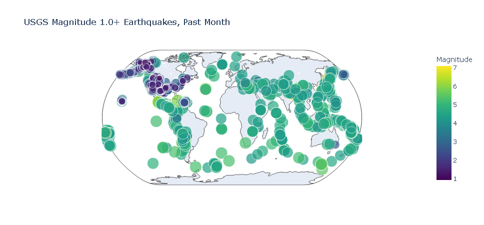

# Earthquake Data Visualization

## Overview
This project visualizes the global distribution of earthquakes that occurred in the previous month. Using a GeoJSON dataset, we map the earthquake locations and display their significance through interactive visualizations created with Plotly's `scatter_geo()` plot.

---

## Features
- **Data Source**: GeoJSON dataset representing worldwide earthquakes from the last month.
- **Visualization**: Interactive map showing earthquake locations and magnitudes.
- **Technology**: Uses Python's `json` module to parse data and Plotly for visualization.

---

## Getting Started

### Prerequisites
- Python 3.7 or later
- Required libraries:
  - `plotly`
  - `json`
  - `pathlib`
  - `notebook`

Install the dependencies using:
```bash
pip install plotly notebook
```

### Dataset
The earthquake dataset is obtained in GeoJSON format from the [USGS Earthquake Catalog](https://earthquake.usgs.gov/earthquakes/feed/v1.0/geojson.php).

---

## Project Structure
```
.
├── eq_data/
│   └── eq_data_1_day_m1.geojson  # GeoJSON file with 1 day earthquake data
│   └── eq_data_30_day_m1.geojson # GeoJSON file with 30 days earthquake data
│   └── readable_eq_data.geojson  # GeoJSON file with readable earthquake data
├── images/
│   └── eq_1_day_m1.png
│   └── readable_eq_data_1.png
│   └── readable_eq_data.png
│   └── example_visualization.png
├── eq_world_map.ipynb  # Jupyter Notebook for data processing and visualization
├── README.md 
```

---

## Usage

1. **Download the GeoJSON Dataset**:
   - Place the downloaded dataset (`*.geojson`) in the `eq_data/` directory.

2. **Open the Jupyter Notebook**:
   - Launch Jupyter Notebook in your terminal or IDE:
     ```bash
     jupyter notebook
     ```
   - Open the notebook file (`eq_world_map.ipynb`).

3. **Run the Notebook**:
   - Execute the cells sequentially to:
     - Load and parse the GeoJSON data.
     - Generate the interactive earthquake visualization.

4. **View the Map**:
   - The map will display within the Jupyter Notebook as an interactive Plotly visualization.

---

## Output
- An interactive map showing:
  - Earthquake **locations** as data points.
  - Magnitude **significance** indicated by marker size and color.

---

## Example Visualization


---

## Next Steps
- Extend the project to analyze trends, such as frequency by region or time.
- Customize the visualization (e.g., color schemes, marker styles) for deeper insights.

---

## Acknowledgments
- Project step-by-step guide found in Python Crash Course by Eric Matthes
- Dataset sourced from the [USGS Earthquake Catalog](https://earthquake.usgs.gov/earthquakes/feed/v1.0/geojson.php).
- Visualization powered by [Plotly](https://plotly.com/).

---

## License
This project is licensed under the [MIT License](LICENSE).
